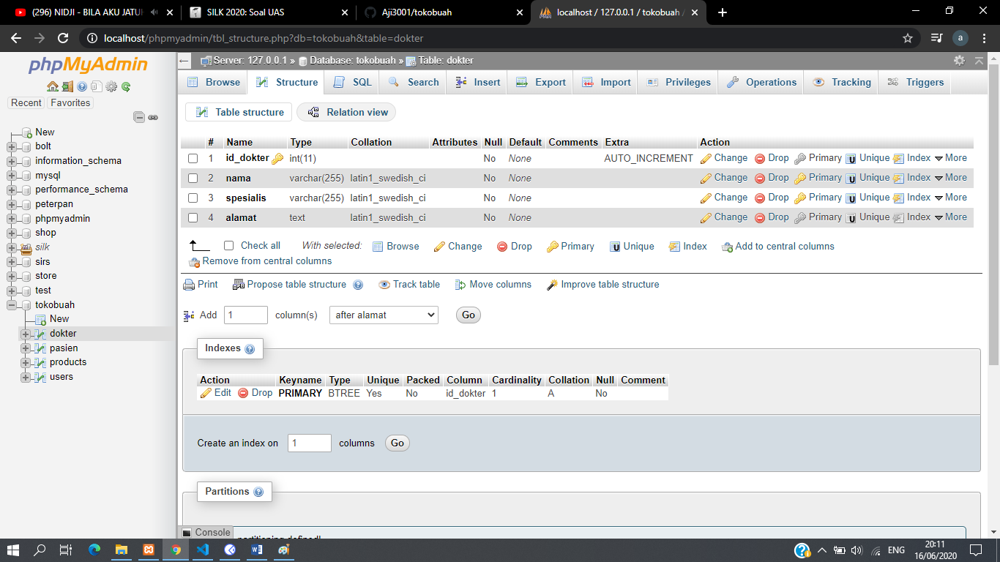
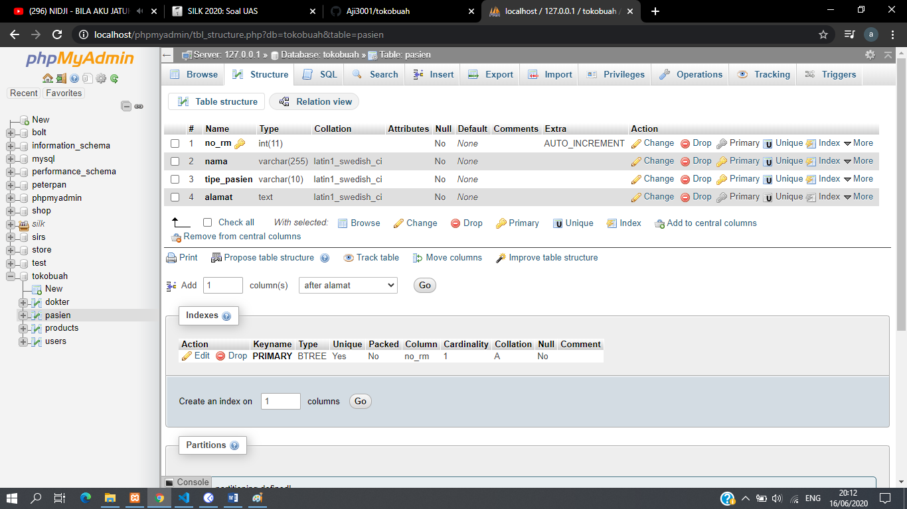

# UAS Tokobuah api
Jawaban UAS Aji Wibowo (72170108)
.
# Tabel
* Dokter

* Pasien

# CRUD Pasien
* Tambah Data Pasien (POST)
<!--  -->

* Ambil Data Pasien (GET)
<!--  -->

* Edit Data Pasien (PUT)
<!--  -->

* Hapus Data Pasien (DELETE)
<!--  -->

# CRUD Dokter
* Tambah Data Dokter (POST)
<!--  -->

* Ambil Data Dokter (GET)
<!--  -->

* Edit Data Dokter (PUT)
<!--  -->

* Hapus Data Dokter (DELETE)
<!--  -->
